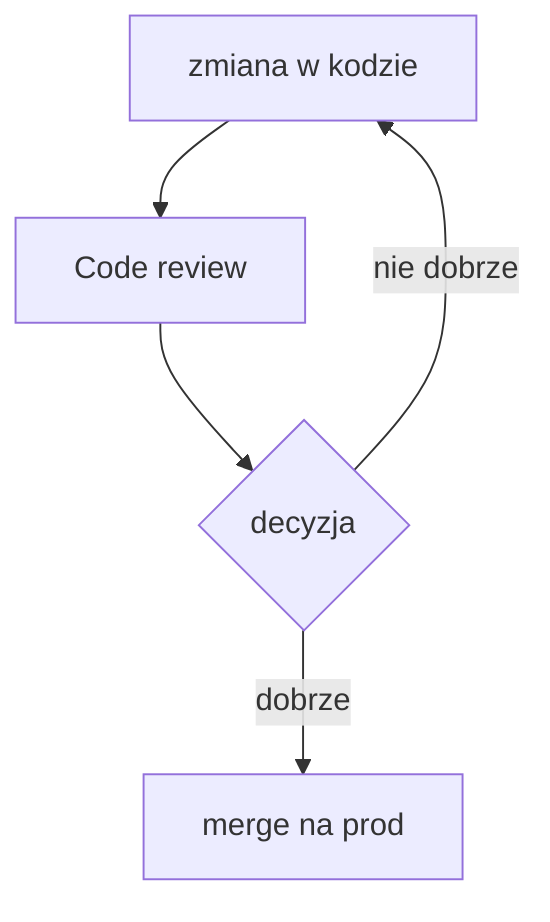

# testowa strona dokumentacji
- standardowy markdown[^1] działa wporządku

ikonki działają :material-check:

inline kodzik też
Użyj `git commit -m "message"` aby utworzyć commit

blok kodu też działa 
``` html title="kodzik.html" linenums="1"
<div style="display: none;">Najlepszy display</div>
<div style="display: block;">Problematyczny display</div>
```



[^1]: Markdown to prosty, lekki język znaczników, który pozwala na formatowanie tekstu za pomocą intuicyjnych symboli (np. # dla nagłówków, * dla list)
