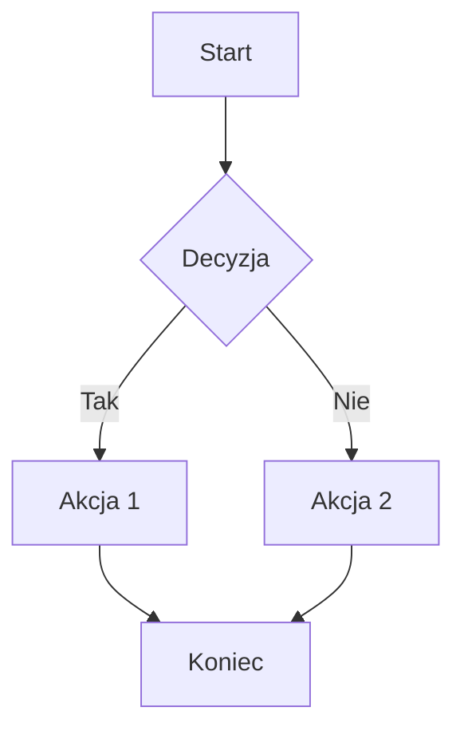
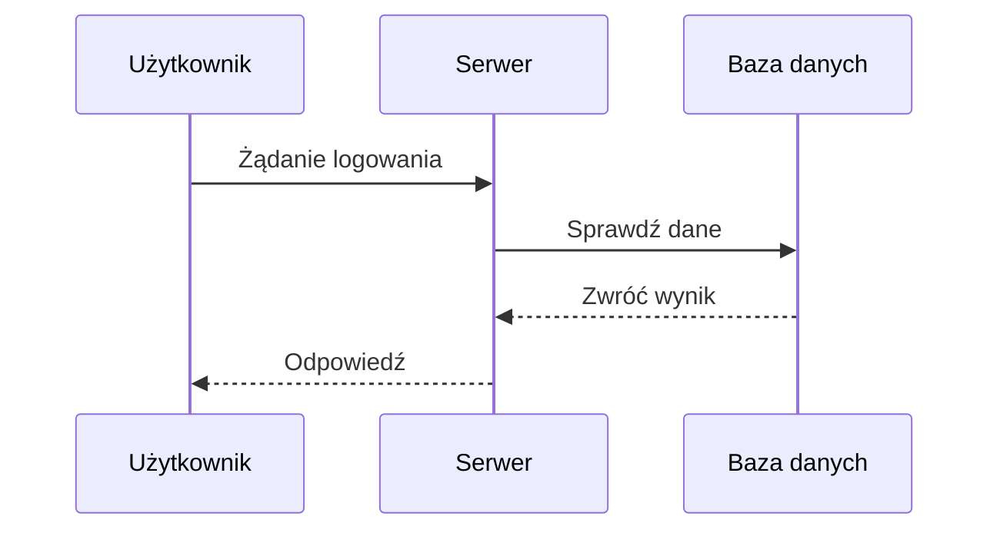
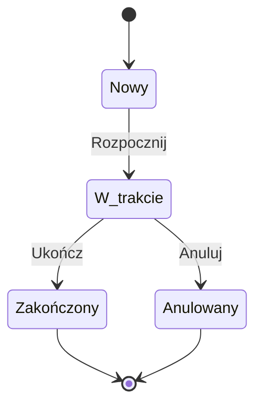
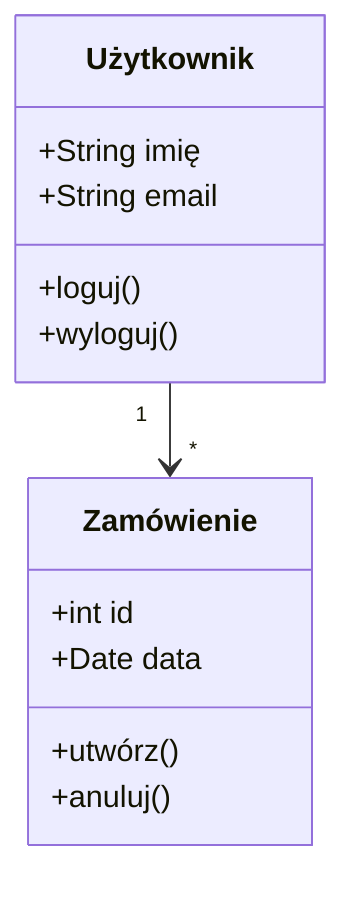
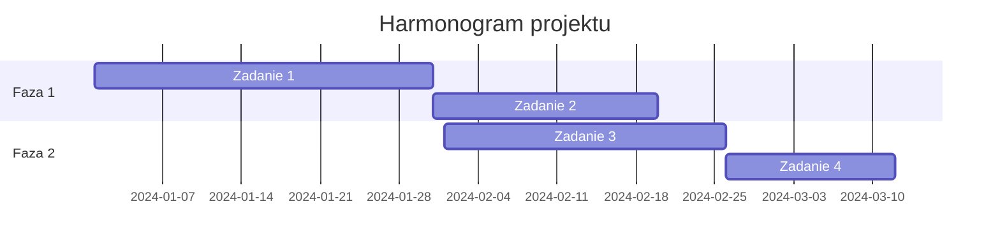
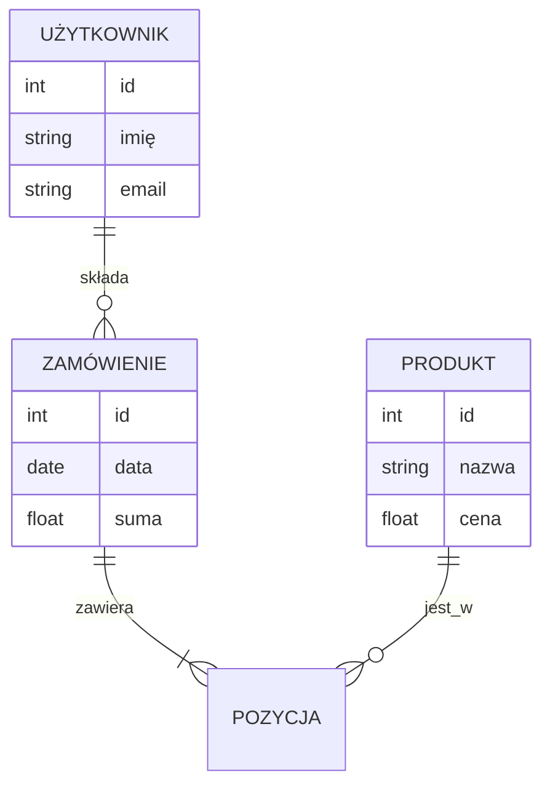
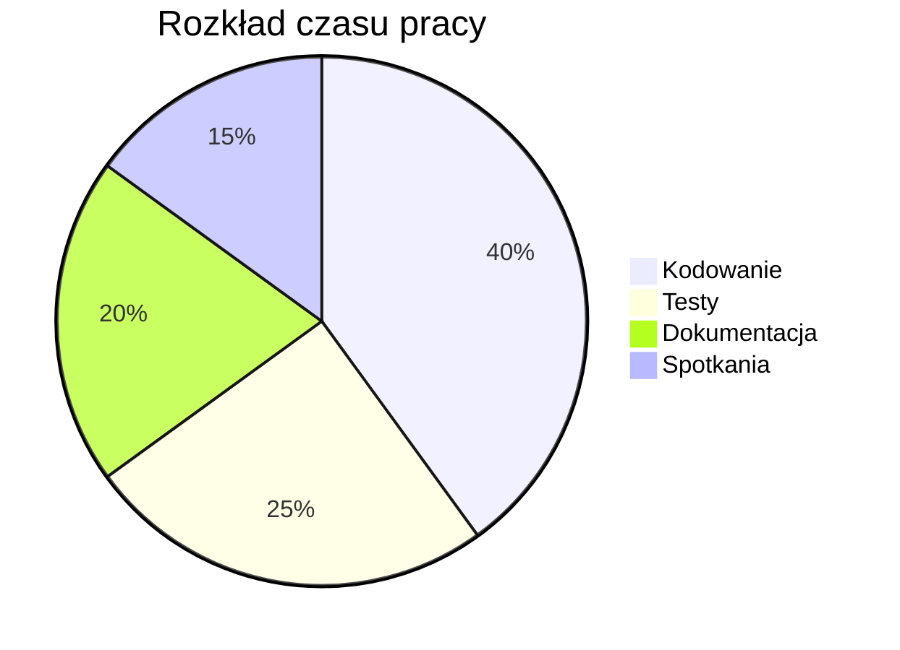
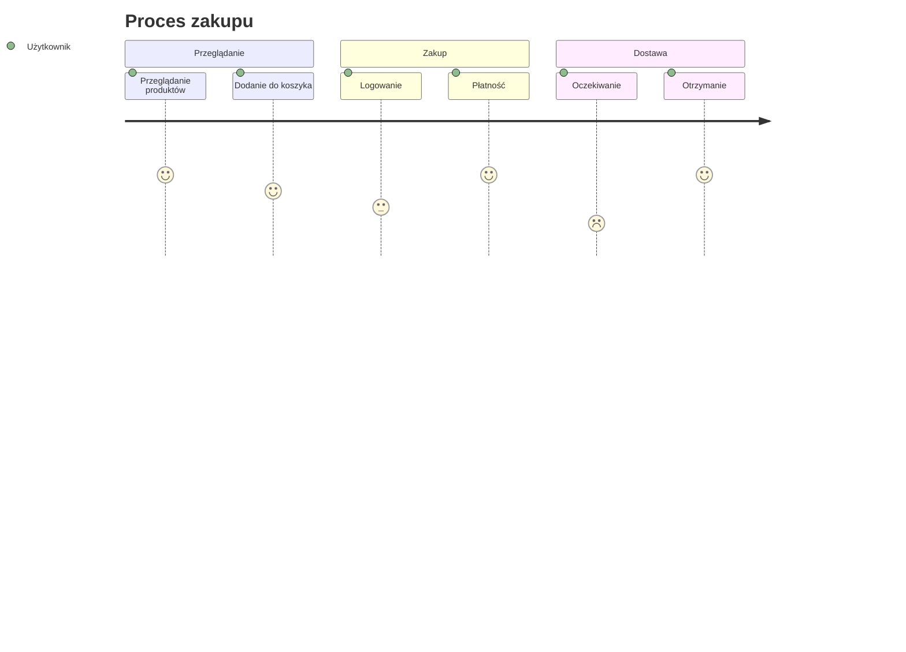

# Diagramy Mermaid

Mermaid to narzędzie do tworzenia diagramów i wykresów używając prostego tekstu. System dokumentacji wspiera diagramy Mermaid, które są automatycznie renderowane.

## Użycie

Diagramy Mermaid tworzy się używając bloku kodu z etykietą `mermaid`:

````markdown

````

## Przykłady

### Diagram przepływu (Flowchart)


### Diagram sekwencji (Sequence)



### Diagram stanów (State)



### Diagram klas (Class)



### Diagram Gantta (Gantt)



### Diagram ER (Entity Relationship)



### Diagram pie chart (Pie)



### Diagram git graph (Git)

```mermaid
gitgraph
    commit id: "Initial"
    branch develop
    checkout develop
    commit id: "Feature A"
    commit id: "Feature B"
    checkout main
    merge develop
    commit id: "Release"
```

### Diagram użytkownika (User Journey)



## Typy diagramów

- **Flowchart** - diagramy przepływu
- **Sequence** - diagramy sekwencji
- **State** - diagramy stanów
- **Class** - diagramy klas
- **Gantt** - harmonogramy
- **ER** - diagramy relacji encji
- **Pie** - wykresy kołowe
- **Git** - wykresy git
- **Journey** - podróże użytkownika

## Wskazówki

- Diagramy Mermaid są renderowane automatycznie
- Możesz używać różnych typów diagramów w jednym dokumencie
- Diagramy są interaktywne i można je powiększać
- Składnia Mermaid jest prosta i czytelna
- Diagramy są przydatne do wizualizacji procesów i struktur

